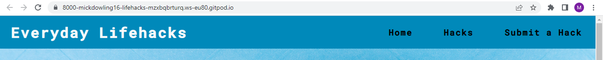
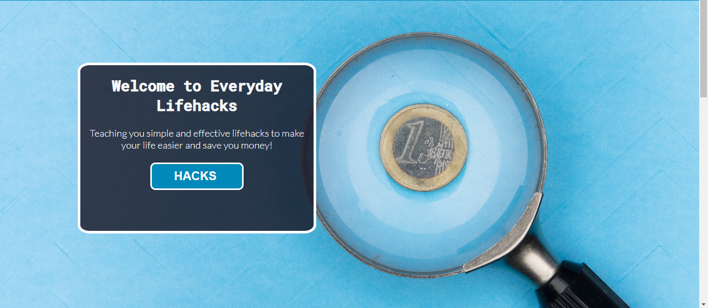
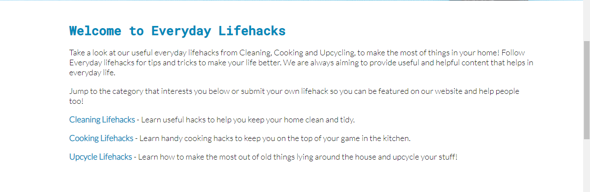
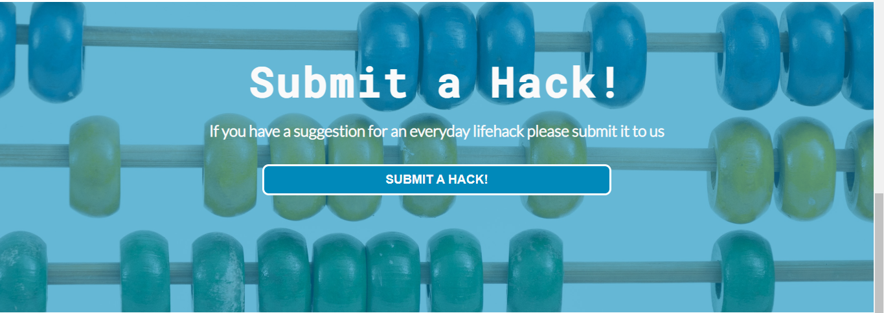
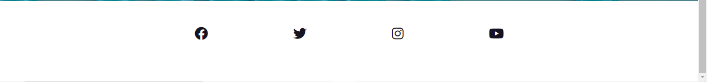
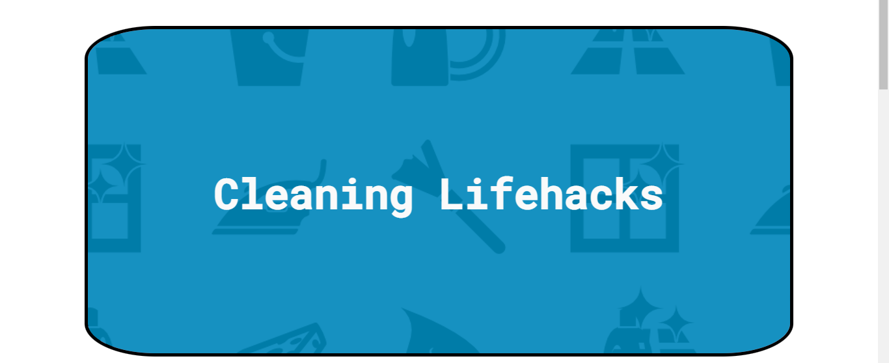
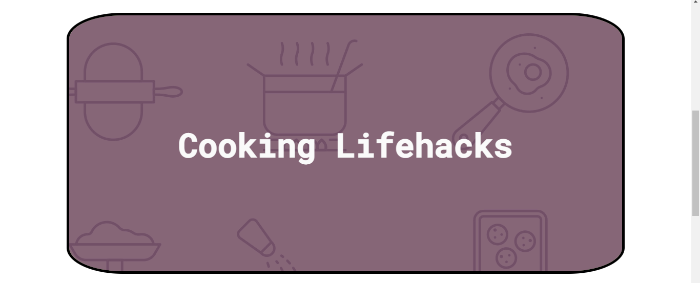
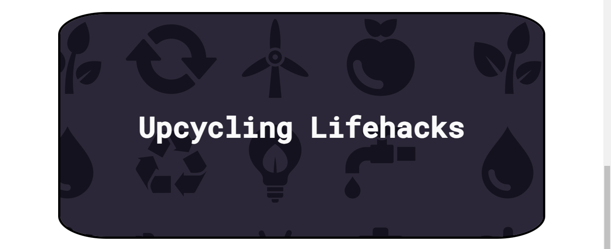
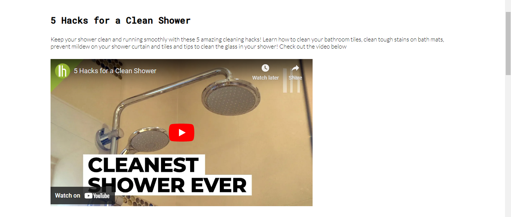
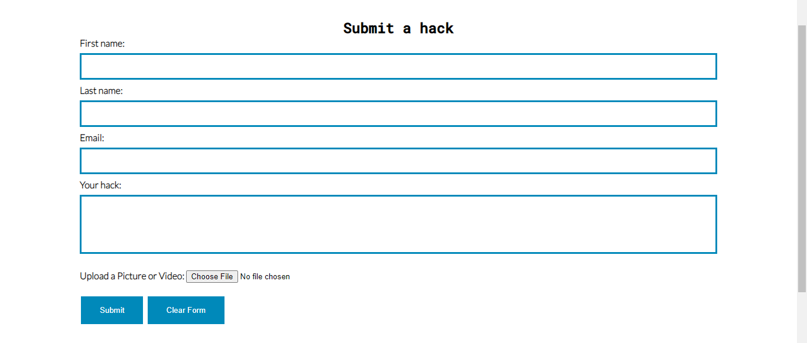

# Everyday Lifehacks - Milestone Project 1

Welcome to Everyday Lifehacks, a simple website set up with the main goals of providing useful tips and tricks you can use around your house to make your life easier and save money. Whether that be cooking, cleaning or giving old things a new purpose, you're sure to learn something new on Everyday Lifehacks.

## Website Purpose

The purpose of this website is to provide value to it's users and act as a place you can regularly visit to pick up new tips and tricks for around your home. The site features a main page with an introduction to the page, links to category pages and a like to the submit a hack page. The site is easily navigatable through the main navigation menu on top of every page or through the links on the main home page

Our category page divides our lifehacks into 3 seperate pages. One for cooking, cleaning and upcycling. These are the main duties everyone does at home. We all have to cook and clean and we aim to provide you with little tips to make these tasks easier, quicker and more economical. We also have the upcycle category, this is to help reuse and recycle any old belongings you have lying around the house and turn them into something useful instead of filling a landfill! For example how to turn your old Jam jars info a terrarium or use old mirrors to create beautiful wall art

We also have a submit a hack page which allows users to fill out the form with their hack and upload supporting photos or videos to be featured on our website. This means we have a good supply of new hacks being submitted to the website, keeping content fresh and up to date. This feature incourages repeat uses as you can see if your hack got featured and read other user submitted hacks updated regularly

## Target Audience

Our target audience for this webiste is anyone looking to save time and money and learn something new to help around the house. This could be homeowners learning new skills to try out in the kitchen, kids learning new cleaning techniques to save time on chores, or the whole family learning how to upcycle old shoe boxes into a fun art project!

# Features

### Navigation Bar

The Navigation bar features on all pages and contains the website logo and links to the main 3 pages. The nav bar is fully responsive to different page sizes. The Everyday Lifehacks logo is also a link back to the homepage. I made the page links a different colour when hovered on to help with user experience

### Hero Image

The hero image is the main image seen when a user uses the site. The images was chosen as it goes with my colour theme and it features a magnifying glass over a euro coin, signifying the money saving aspect of the lifehacks. I thought the picture went well with the overall theme of the website. The hero image also contains text to welcome the user to the site and a button with a link to the hacks category page so the user can access the info they need quickly without having to scroll through the page.

### Main body

The main body of the home page further explains the purpose of the website. It gives users an insight into what to expect on the website and offers direct links to the 3 different category pages. The main body text carries on the colour theme of the website.

### Submit A Hack Button

This section of the home page allows users to jump straight to the submit a hack page to fill out the form and submit their own lifehacks. This section follows the colour theme of the website with a blue overlay over the background image and a scroll effect on the background making it seem like the image is moving behind the text. This section also included a button with the same colour scheme as previously used

### Footer

The idea for the footer came from the love running project. I liked the simple but effective layout of the social media icons. I changed the icon colour to the secondary website colour to match the theme and added a little bit of copyright text below. Lifehacks are often shown in videos and pictures so social media would be a big part of this website so I thought the simple footer with the social icons fit perfectly.

### Hacks page

On the hacks page I wanted to create a visual way of sorted the lifehacks into 3 main categories. I done this by creating 3 seperate divs with borders and background images and using this as my category page. You can see by the pictures below the icons in the background match the corresponding category and i have used the main colours of the website as an overlay. I also used the scroll effect on these background as it appears when your scroll down the page the background changes. I thought this was a sun way of making a category page and adds to the design of the website. These divs are also fully responsive and change size to better fit smaller screens as to not be too big on mobile devices. 

### Hacks articles

In the hacks pages I used a combination of iframes and images in my articles for photos and videos. I thought this would give a better user experience as visual aids are more helpful when learning. The iframes are videos taken from youtube and all links and videos will be referenced below. The video and image dimensions are the same in order for the website to look uniform and they both are fullt responsove to smaller screen sizes

### Submit A Hack Form

The submit a hack form is where users can submit their own hacks to be featured on the website. This will drive website interaction and create a community of lifehackers! The form design follows the website colour scheme. The form also allows users to submit a photo or video with their hack so they can show their hacks in more detail

