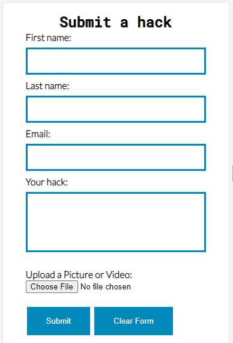

# Everyday Lifehacks - Milestone Project 1

Welcome to Everyday Lifehacks, a simple website set up with the main goal of providing useful tips and tricks you can use around your house to make your life easier and save money. Whether that be cooking, cleaning or giving old things a new life, you're sure to learn something new on Everyday Lifehacks.

## Initial Discussion
---

Everyday Lifehacks is a collection of useful lifehacks with the aim to provide value to its users and act as a place where people can share their own lifehacks and pick up tips and tricks along the way. 
Everyday lifehacks has a large following on social media platforms where they share pictures and videos from different accounts on many different platforms. They needed a central location to share content and for their engaging audience to submit their own content to be featured on the site. By having their own website, Everyday Lifehacks can become the one stop shop for all lifehacks on the internet!

## User Stories

### Client Goals

- To be able to view the site on a range of different devices.
- To be able to clearly read and view articles on mobile, tablet and desktop
- To make it easy for users to view different categories of lifehacks
- To make it easy for users to submit their own lifehack with supporting pictures or videos
- To access the original content creators’ websites, channels or social media platforms

### First Time Visitor Goals

- I want to be able to quickly navigate to the lifehack category I need
- I want to be able to navigate through the site easily with minimal clicks
- I want to be able to find Everyday Lifehacks on social media

### Returning Visitor Goals

- I want to be able to easily submit a hack using the form on the site
- I want to be able to find new lifehacks when they are added to the site

# Design
---

### Colour Palette

I went for this colour scheme as I wanted the main colour of blue to be bright, welcoming and easily recognisable. The other colours went well with the theme, with navy used as my main second colour along with black, white and purple

### Typography 

I used Google fonts in this project

- I used Lato for the body paragraph elements with Arial as a backup
- I used Roboto Mono for the headings and sans-serif as a backup

### Media

My images and videos were taken from a variety of different places. My embedded YouTube videos come from various lifehacks channels, all which are credited on the website and below in the credits section

My images were taken from lifehack websites and free stock photo websites, pexels, unsplash and pixabay. All photos are also credited in the credit section

# Features

This website is made up of 7 pages in total, the home page, the hacks category page, 3 different category pages with articles, a submit form page and a thank you page. 

### Navigation Bar

The Navigation bar features on all pages and contains the website logo and links to the main 3 pages. The nav bar is fully responsive to different page sizes. The Everyday Lifehacks logo is also a link back to the homepage. I made the menu a different colour when hovered on to help with user experience

### Hero Image

The hero image is the main image seen when a user loads the site. The images was chosen as it goes with my colour theme and it features a magnifying glass over a euro coin, signifying the money saving aspect of the lifehacks. I thought the picture went well with the overall theme of the website. The hero image also contains text to welcome the user to the site and a button with a link to the hacks category page so the user can access the info they need quickly without having to scroll through the page.

### Main body

The main body of the home page further explains the purpose of the website. It gives users an insight into what to expect on the website and offers direct links to the 3 different category pages. The main body text carries on the colour theme of the website. I originally had a white background with blue links but it didn't pass the accessibility test on lighthouse so I changed the background colour to the navy seen in the colour scheme.

### Submit A Hack Button

This section of the home page allows users to jump straight to the submit a hack page to fill out the form and submit their own lifehacks. This section follows the colour theme of the website with a blue overlay over the background image and a scroll effect on the background making it seem like the image is moving behind the text. This section also included a button with the same colour scheme as previously used

### Footer

The idea for the footer came from the love running project. I liked the simple but effective layout of the social media icons. I changed the icon colour to dark navy with a hover colour of blue to match the theme. Lifehacks are often shown in videos and pictures so social media would be a big part of this website so I thought the simple footer with the social icons fit perfectly.

### Hacks page

On the hacks page I wanted to create a visual way of sorting the lifehacks into 3 main categories. I done this by creating 3 seperate divs with borders and background images and used this as my category page. You can see by the pictures below the icons in the background match the corresponding category and I have used the main colours of the website as an overlay. I also used the scroll effect on the background as it appears when your scroll down the page the background changes to match the category. I thought this was a fun way of making a category page and adds to the design of the website. These divs are also fully responsive and change size to better fit smaller screens as to not be too big on mobile devices. 

### Hacks articles

In the hacks pages I used a combination of iframes and images in my articles for photos and videos. I thought this would give a better user experience as visual aids are more helpful when learning. The iframes are videos taken from youtube and all links and videos will be referenced below. The video and image dimensions are the same in order for the website to look uniform and they are both fully responsive to smaller screen sizes

### Submit A Hack Form

The submit a hack form is where users can submit their own hacks to be featured on the website. This will drive website interaction and create a community of lifehackers! The form design follows the website colour scheme. The form also allows users to submit a photo or video with their hack so they can show their hacks in more detail. For an added design element in the form I added the colour blue to the text boxes when clicked.

### Thank you page

This page was created to let the user know their form was submitted. This is a simple page with a thank you message and a button to return to the home page. This was a later addition to my website as I thought the user might get confused when submitting the form if their was no feedback to tell them their submission was successful.

## Accessibility
I have tried to make my website as accessible as possible by using the below features

- Using semantic HTML.
- Using alt attributes on all images on my website.
- Making sure that there is a sufficient colour contrast throughout the site and text and headings are easily readable.

# Testing
---

During this project I regularly tested my site using Chrome developer tools and HTML and CSS code validator. This helped me with the responsiveness of my site and also to make sure the code I had written was up to industry standard and there were no obvious mistakes.

## W3C Validator Results

I tested each page of my website's code in the HTML Validator and the results are linked to below. I also tested my CSS code in the validator and the results are also linked below

- [HTML Validator Tests and Results](supporting/html-test.md)
- [CSS Validator Tests and Results](supporting/css-test.md)

## Solved Bugs

1. The page always had a margin at the top, resulting in a white gap between the navigation and the top of the page. I fixed this by using an asterisk and setting the padding and margin to 0. This allowed me to overwrite any code that was causing the top margin of the page. 

2. When using YouTube embedded videos it was greatly effecting the loading speed of my website. This was a big problem as it was one of my main sources of content. To fix this I used a third party website which takes the YouTube link and converts it and provides you with their own link which embeds the YouTube video to only load when the user clicks the play button. Since I implemented this, my site loading speed is a lot faster. 

3. When trying to submit my form I kept getting a 405 not allowed error. My method was set to post and I tried to put the action as form.php so the responses would be recorded in this php file. This didn't work and I was stuck on this section for quite a while. I searched on slack and found someone else had previously had this problem, so the solution was to change it to a get method and put the action as thanks.html. This meant I could remove the link I had put on my submit button to bring the user to the thank you page.

## Unsolved bugs

1. Although I got my submit form to work and display my thank you message using the get method, this wouldn't be very practicle for the type of information I need to collect using my form. I think the post method would be far better but I couldn't figure this out. When I looked online it says my action attribute needs to point to a php file in order to send the data to this file, but when I did this it returned an error. I'm not sure how I would get this to work so I switched to the get method as it worked and did display the form info in the url on the thank you page. In a future project I would like to work on correcting this as my knowledge on the topic improves.

## Lighthouse

I used lighthouse to test the performance of my website. These tests returned some unexpected results and forced me to change some elements of my site in order to increase the website speed. Below are the results

### Homepage

The first test I did on lighthouse was the index.html page. The score for accessability and best practices were good but the performance and SEO score were letting me down. I knew my images on the homepage were not optimised for web so this is something that will bring up my performace score and also I haven't added any keywords to my pages so this should bring up my SEO score.

To improve this score I converted my hero image and my submit a hack background images to webp files. This drastcally reduced the file sizes leading to faster loading times. I also added a meta description and meta keywords to the head of the page to improve SEO. I also changed the colour of the background, text and links in the main body to be more readable.

### Lifehack Pages

When I tested my lifehack pages with lighthouse I found that my embedded youtube videos were seriously reducing the speed of my site. When doing some research I found that because of how much external content they have to load, they require a longer page loading time. I had to rethink what I was going to do because they were a main part of my website but I didn't want to have a slow site

As you can see from the above screenshot, my performace score was very low on my cleaning hacks page. To fix this I researched how to load YouTube embeds faster. There was some solutions using JavaScript but my knowledge of this language got in the way of me being able to use this as a solution. Another solution I found was a website that converts Youtube videos for embedding into smaller load times by only loading the video when the user presses the play button. I changed all my embedded videos to these different links and tested it out. I also changed any images I had to webp format to reduce file size.

These changes worked and my scores are now all in the high 90s on all my lifehack pages. 

### Category Page

When testing the categories page I knew that the background images in the category divs were not optimised for web and I would get the same error messages as I did with the homepage. Also the SEO score was the same as I needed to add meta descriptions and keywords

To fix these issues I converted the backgroud images I made to webp format and reduced the file size. I also added the meta description and keywords to the page for SEO. I'm hoping this will increase my site score

In the second test we can see that these changes had a positive effect on the overall website performace and SEO score.

### Submit A Form Page

I tested the submit a form page on lighthouse and the first test came back good for everything but the SEO score, with the same issues as the other pages. 

I fixed the SEO score by adding the meta description and keywords to the head of the page

## User Stories

| Client Goals | Testing |
| ----------- | ----------- |
| To be able to view the site on a range of different devices. | To test this I used Google Chrome Developer tools to test different device sizes and make sure my website was readable on all devices. I used media queries in my CSS code to do this |
| To be able to clearly read and view articles on mobile, tablet and desktop | For the article pages I made sure there was enough padding and spacing between each article and that the article and media responded to changing screen sizes|
| To make it easy for users to view different categories of lifehacks | I done this by making the hacks page with each different category having its own clickable box for users to easily choose which category they would like to view |
| To make it easy for users to submit their own lifehack with supporting pictures or videos | The submit a hack page allows users to fill out the form and attach any media they would like to support their hack |
| To access the original content creators’ websites, channels or social media platforms | Each video is embedded from YouTube and the content creator is creditted below each with a link to their YouTube channel |

| First Time User Goals | Testing |
| ----------- | ----------- |
| I want to be able to quickly navigate to the lifehack category I need | The hacks page is easily accessable through the main navigation which appears on every page. On the homepage there is also links to each indiviual category so a user can skip by the category page and jump straight to the page they want |
| I want to be able to navigate through the site easily with minimal clicks | Everything on the website is available within 2 clicks, making it very easy to navigate. |
| I want to be able to find Everyday Lifehacks on social media | There are social media links in the footer of every page, making them very easy to find |

| Returning User Goals | Testing |
| ----------- | ----------- |
| I want to be able to easily submit a hack using the form on the site | Our submit a hack form can be accessed directly from the main navigation or the button on the homepage making it very easily accessable. The form is simple and allows users to attach media if they choose |
| I want to be able to find new lifehacks when they are added to the site | New lifehacks are added to the top of the page so when you go to the category you want, the top article will be the newest |

## Responsiveness

### Mobile

### Ipad

## Browser Testing

I tested my website on different browsers to make sure it was responsive and worked as excepted on the 3 main browsers, Chrome, Microsoft Edge and Firefox. Below are the results 

| What was tested | Chrome | Edge | Firefox |
| ----------- | ----------- | ----------- | ----------- |
| Homepage buttons | Buttons linked to correct pages and worked as expected | Buttons linked to correct pages and worked as expected | Buttons linked to correct pages and worked as expected |
| Category links on homepage | links went to correct pages and worked as expected | links went to correct pages and worked as expected | links went to correct pages and worked as expected |
| Homepage styling | Homepage styling looks correct and the way it was intended | Homepage styling looks correct and the way it was intended | Homepage styling looks correct and the way it was intended |
| Homepage responsiveness | Homepage fully responsive and working well on all screen sizes | Homepage fully responsive and working well on all screen sizes | Homepage fully responsive and working well on all screen sizes |
| Hacks page links and styling | Hacks page correctly links to intended pages and styling looks as it is suppose to | Hacks page correctly links to intended pages and styling looks as it is suppose to | Hacks page correctly links to intended pages. Font weight looks a little different but this could be just how the browser displays it, all other styling is consistent |
| Hacks page responsiveness | Hacks page fully responsive. Divs and text change to correct size on different devices  | Hacks page fully responsive. Divs and text change to correct size on different devices | Hacks page fully responsive. Divs and text change to correct size on different devices |
| Lifehack article pages | All articles are fully responsive. Images, videos and text change size to match screen size. When testing I noticed the padding at the top of each article was a bit big so I will change this so articles appear a small bit closer together  | All articles are fully responsive. Images, videos and text change size to match screen size | All articles are fully responsive. Images, videos and text change size to match screen size |
| Submit a hack form | The form returned a 405 error when trying to submit, I changed the method and action and now form works perfectly. This change is mentioned in solved bugs  | The form returned a 405 error when trying to submit, I changed the method and action and now form works perfectly. This change is mentioned in solved bugs | The form returned a 405 error when trying to submit, I changed the method and action and now form works perfectly. This change is mentioned in solved bugs |
| Submit a hack responsiveness | The form is fully responsive to all screen types and looks as intended | The form is fully responsive to all screen types and looks as intended | The form is fully responsive to all screen types and looks as intended |
| thank you page responsiveness | The thank you page was not fully responsive and the content affected the footer on smaller devices. This has been changed using media queries and looks as intended now | The thank you page was not fully responsive and the content affected the footer on smaller devices. This has been changed using media queries and looks as intended now | The thank you page was not fully responsive and the content affected the footer on smaller devices. This has been changed using media queries and looks as intended now |
| footer | All social media links work as intended and open page in new tab. The icons also change colour when hovered on | All social media links work as intended and open page in new tab. The icons also change colour when hovered on | All social media links work as intended and open page in new tab. The icons also change colour when hovered on |

# Deployment

I deployed my project using Github pages. Below are the steps I followed to achieve this

- In the GitHub repository named lifehacks, navigate to the Settings tab
- On the left hand side under code and automation, click pages
- Under the Build and Develop section set Source to Deploy from a branch and set the branch to main
- Run this and a link to the website will appear

This is the live link - https://mickdowling16.github.io/lifehacks/index.html

# Credits

In this section you will find my references for where I found my content and information for this website.

## Content

The content for the articles on this site were taken from The YouTube videos used and also articles on lifehacks and upcycling. The majority of the code was written by myself with small bits taken from other sources, all linked below

- YouTube Video links were video descriptions were used in the text of my articles. - [YouTube Video Links](supporting/youtube-links.md)
- The footer on my website was taken from the love running project we done in HTML & CSS fundimentals. I liked the minimalistic design of it and all I wanted from my footer was social media links so it worked well with the project. 
- To convert the YouTube videos to a smaller size in order to be embedded I used this website - https://tube.rvere.com/
- For the cooking lifehacks that were submitted by a user I used this article for the content - https://www.eatthis.com/kitchen-hacks-cooking-tips/
- For the upcycle lifehacks content I used these 2 websites - https://cleaning-hacks.sharkclean.co.uk/3-simple-upcycling-ideas/ & https://www.lifehack.org/486497/5-ways-to-upcycle-for-unique-home-decor
- The icons used in the footer were taken from - https://fontawesome.com/
- I used W3Schools to help with some of my code if I got stuck or couldn't remeber a certain attribute. I also used their code editor to quickly test some elements before putting them into my project.

## Media

- The YouTube embedded videos were taken from various lifehack channels and all links can be found under the videos on the website and also here - [YouTube Channel Links](supporting/youtube-links.md)
- The images I used were taken from a variety of different websites including pexels, pixabay and unsplash. I also found images for my lifehack pages on articles and google images. For the backgrounds in the category divs, I made these myself using pixlr.com and icons I found on Google images. All links to images can be found here - [Image Links](supporting/image-links.md)