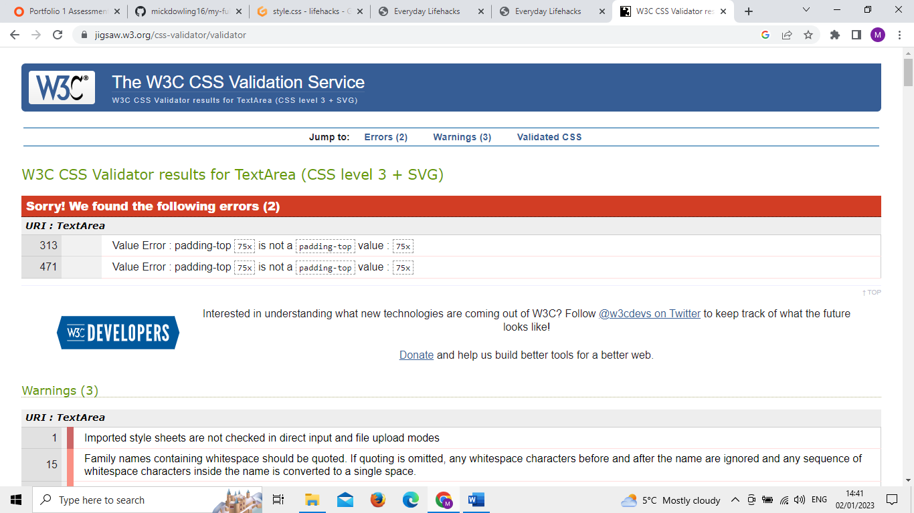
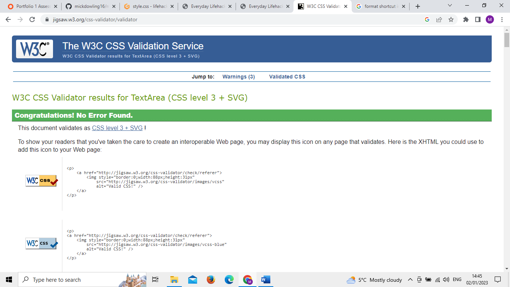
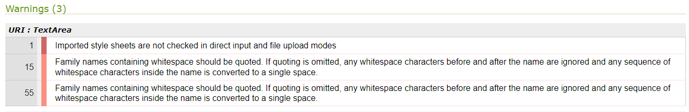
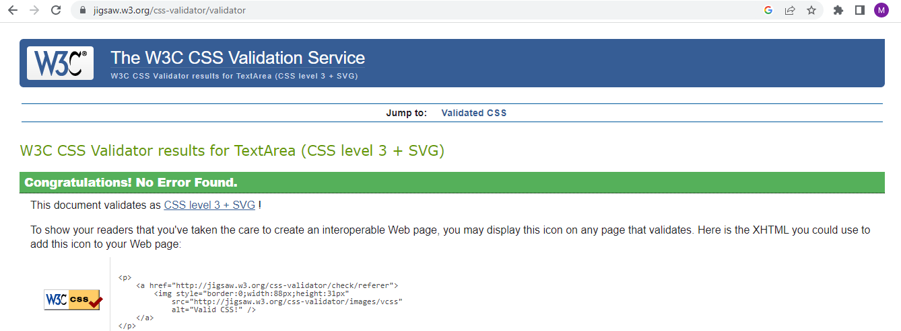

# CSS Validatior Tests

The first test on my CSS code returned 2 errors. These were just typos and easy to fix

The second test returned no errors but 3 warnings.

The warnings below showed up in the validator. For 2 of them I just had to include quote marks on my font. The other warning was just saying it would not check the imported style sheet from Google so I could ignore that one.

Once these changes were made I tested it again but left out the first line relating to the Google fonts external sheet. This was the result

